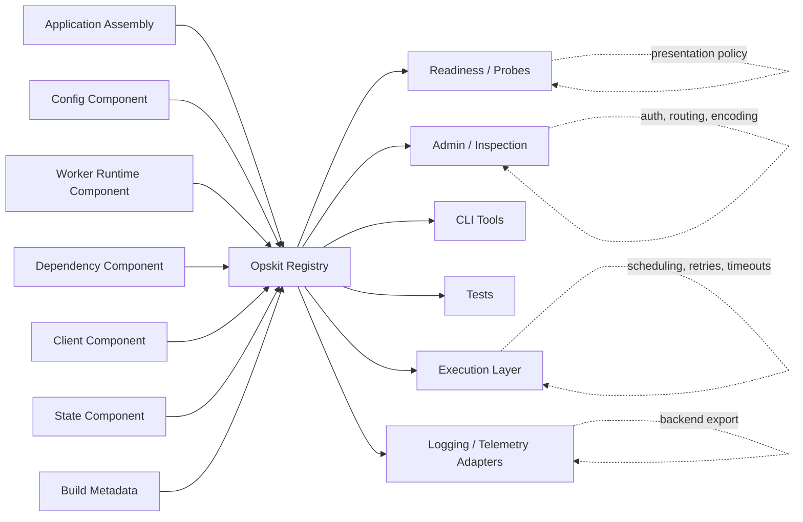
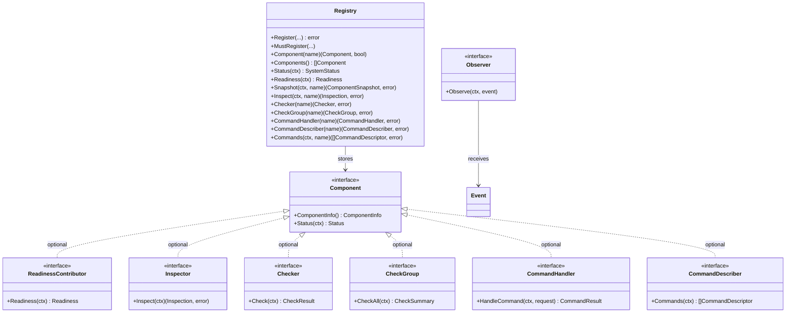
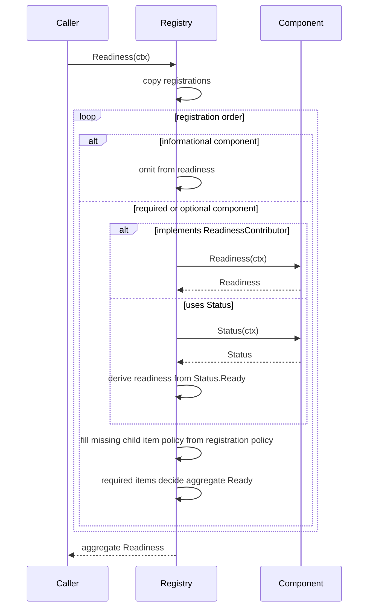
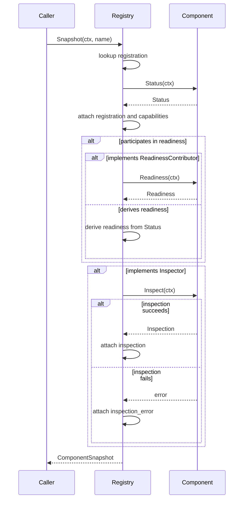

# Opskit Design

Opskit is the shared operational contract layer for Go services.

It gives service components one common language for identity, status, readiness,
inspection, checks, commands, events, and safe operational metadata.

Opskit is deliberately small. It does not run the service. It does not present
HTTP routes. It does not start goroutines. It does not execute checks or
commands. It does not export telemetry. It defines the contracts that let those
systems compose without importing each other.

For field-level API details, see [API Map](api.md).

## The Problem

Production Go services tend to rebuild the same operational shell:

- probes and readiness surfaces
- component status
- dependency health
- config load and reload state
- worker lifecycle state
- outbound client health
- admin inspection
- operational commands
- diagnostic events
- safe metadata for logs, tests, and support tooling

Each concern can be implemented cleanly on its own. The problem appears at the
service boundary.

Without a shared contract, every package starts needing custom glue:

```text
config -> http
config -> workers
dependencies -> http
dependencies -> workers
clients -> http
clients -> workers
state -> http
state -> workers
```

That glue is not business logic. It is operational plumbing.

Opskit pulls that shared plumbing into one small contract package. A component
can say:

```text
this is who I am
this is my status
this is whether I am ready
this is safe diagnostic detail
this is how I can be checked
this is what commands I support
this is the event shape I emit
```

Everything else decides what to do with that information.

## Design Thesis

Opskit exists to keep production service mechanics composable without turning
the application into a framework.

The design is built on three decisions.

First, operational state is ordinary Go. Components implement small interfaces.
Registries are explicit values. Data is plain structs. There is no hidden global
runtime.

Second, passive description is separated from active execution. Status,
readiness, inspection, and snapshots describe current operational state. Checks
and commands are discoverable capabilities, but Opskit does not decide when they
run.

Third, policy stays outside Opskit. Applications, HTTP layers, worker runtimes,
and domain packages decide what to expose, when to execute, how to authorize,
how to retry, and what business behavior follows.

## What Opskit Owns

Opskit owns the shared operational vocabulary:

- component identity
- component status
- readiness contribution
- readiness aggregation
- safe inspection
- active check result shapes
- grouped check result shapes
- command request and result shapes
- backend-neutral events
- observer contracts
- safe attributes
- registry read models
- capability discovery

Opskit gives these concepts stable names and JSON shapes so service code,
libraries, tests, CLIs, HTTP surfaces, and worker runtimes can agree on the same
model.

## What Opskit Does Not Own

Opskit does not own runtime behavior.

It does not provide:

- HTTP routing, middleware, probes, response encoding, or admin route exposure
- goroutine lifecycle, worker scheduling, retries, jitter, or concurrency limits
- command dispatch, command authorization, audit logging, or admission policy
- configuration loading, client construction, dependency registration, or state
  persistence
- OpenTelemetry exporting, logging backends, dashboards, or alerts
- application hosting, dependency injection, or business policy

Those responsibilities belong to applications and higher-level packages.

This boundary is the design. Opskit is useful because it stays beneath those
concerns.

## Mental Model

Opskit sits at the service assembly boundary.

Components register operational state and capabilities. Callers consume registry
read models or discover optional capabilities. Presentation layers decide how to
show them. Execution layers decide when to run them.



The registry is a passive read model. It stores components, evaluates their
descriptive methods when asked, and exposes optional capabilities.

It does not own the lifecycle of the components it stores.

## Core Contract

Every registered component implements one required interface:

```go
type Component interface {
	ComponentInfo() ComponentInfo
	Status(context.Context) Status
}
```

`ComponentInfo` gives the component a stable operational identity.

`Status` reports the component's current local state. Status should be cheap,
descriptive, and safe to expose.

A component may also implement optional capabilities:

```go
type ReadinessContributor interface {
	Readiness(context.Context) Readiness
}

type Inspector interface {
	Inspect(context.Context) (Inspection, error)
}

type Checker interface {
	Check(context.Context) CheckResult
}

type CheckGroup interface {
	CheckAll(context.Context) CheckSummary
}

type CommandHandler interface {
	HandleCommand(context.Context, CommandRequest) CommandResult
}

type CommandDescriber interface {
	Commands(context.Context) []CommandDescriptor
}

type Observer interface {
	Observe(context.Context, Event)
}
```

These optional interfaces let components participate in richer operational
surfaces without forcing every component to implement every behavior.



## Status Is Descriptive

`Status` answers:

```text
What state is this component in right now?
```

Status should normally come from cached or local state. It should not perform
active work.

Good status work:

- return current lifecycle state
- return last known dependency state
- return whether config is loaded
- return whether a worker runtime is draining
- return safe low-cardinality attributes
- explain degraded or not-ready state with a redacted message

Bad status work:

- ping a database
- call a remote service
- reload config
- dispatch a command
- run retries
- start background work
- mutate lifecycle state

Active work belongs in checks, commands, workers, or application code.

## Readiness Is Admission

Readiness answers:

```text
Should this service receive work?
```

Readiness is related to status, but not identical to status.

A degraded component may still be ready. An optional component may be not ready
without blocking the service. An informational component may never participate in
readiness at all.

Opskit supports this distinction with registration policy:

```go
ops.MustRegister(database, opskit.Required())
ops.MustRegister(searchClient, opskit.Optional())
ops.MustRegister(buildInfo, opskit.Informational())
```

Policy meanings:

- `required`: appears in readiness and blocks aggregate readiness when not ready
- `optional`: appears in readiness but does not block aggregate readiness
- `informational`: appears in status and snapshots but is omitted from readiness

If no required readiness components are registered, aggregate readiness is not
ready. That fail-closed behavior prevents a service from accidentally becoming
ready without an explicit readiness contract.

## Readiness Flow

`Registry.Readiness(ctx)` creates the service-level admission view.



The registry aggregates readiness. It does not perform health checks. Expensive
health checks should be run elsewhere and stored as local component state before
readiness is evaluated.

When a readiness contributor returns child readiness items, Opskit preserves any
explicit child item policy. If a child item omits policy, Opskit fills it from
the component's registration policy.

## Inspection Is Safe Diagnostic Detail

Status and readiness should stay compact. Inspection is for richer operational
detail.

`Inspector` lets a component expose safe diagnostic data for admin endpoints,
support tooling, tests, or CLI output.

Inspection is intentionally flexible:

```go
type Inspection struct {
	Summary    any
	Details    any
	Attributes []Attribute
}
```

That flexibility comes with a strict rule:

```text
Everything returned through Opskit must be safe to expose.
```

Do not return secrets, tokens, raw connection strings, raw SQL, request bodies,
private user data, or unredacted errors.

Opskit does not redact inspection data. Components must return safe data before
it enters the registry.

## Snapshot Flow

`Registry.Snapshot(ctx, name)` builds one component's combined operational view.

It includes:

- component identity
- registration policy
- detected capabilities
- status
- readiness when the component participates in readiness
- inspection when supported
- inspection error when inspection fails



Snapshot inspection failures are represented as data, not fatal snapshot errors.
That lets admin surfaces still show identity, status, readiness, and capability
metadata even when detailed inspection is broken.

Direct calls to `Registry.Inspect(ctx, name)` remain strict and return the
inspector error.

## Checks Are Active

Checks are active operational probes.

Examples:

- ping a database
- verify an outbound target
- validate a filesystem mount
- check a queue connection
- probe a dependency group

Opskit defines the result shape:

```go
type Checker interface {
	Check(context.Context) CheckResult
}

type CheckGroup interface {
	CheckAll(context.Context) CheckSummary
}
```

Opskit does not decide when checks run. It does not schedule them, retry them,
cache them, or decide whether they should affect readiness.

A worker runtime, CLI command, test, admin route, or application-owned loop can
discover the capability and invoke it explicitly.

## Commands Are Control-Plane Contracts

Commands represent operational control-plane actions.

Examples:

- `config/reload`
- `cache/refresh`
- `index/rebuild`
- `dependency/check`
- `worker/drain`

Opskit defines the request and result shape:

```go
type CommandHandler interface {
	HandleCommand(context.Context, CommandRequest) CommandResult
}

type CommandDescriber interface {
	Commands(context.Context) []CommandDescriptor
}
```

`CommandDescriber` is passive command metadata. It lets presentation layers,
CLIs, worker runtimes, and docs generators discover supported command names and
operator-facing hints without invoking the command.

Opskit does not dispatch commands. It does not authorize callers. It does not
validate user input. It does not enforce concurrency. It does not retry commands
or audit their execution.

Those responsibilities belong to the caller, usually an execution layer or a
protected presentation layer.

## Events Are Backend-Neutral

Opskit defines a small event envelope and observer interface.

Events can be mapped to:

- `slog`
- OpenTelemetry
- test collectors
- audit sinks
- custom logging systems
- no-op observers

The root package does not import OpenTelemetry and does not configure telemetry
backends.

Telemetry belongs where work happens:

- HTTP telemetry belongs in the HTTP layer
- worker/check telemetry belongs in the worker runtime
- config lifecycle telemetry belongs in the config package
- outbound request telemetry belongs in the client package
- dependency-check telemetry belongs in the dependency package

Opskit gives those systems a common event shape. It does not become the
telemetry system.

## Standalone Use

Opskit does not require the rest of the Kit Series.

Use it directly when an application already has its own HTTP server, CLI, worker
runtime, tests, or platform integration, but wants one consistent operational
model.

Good standalone fits include:

- backing an existing readiness endpoint
- powering CLI commands such as `status`, `inspect`, or `check`
- giving tests one shared readiness model
- exposing safe component snapshots through an existing admin surface
- standardizing operational state across application-owned components

Standalone usage keeps the same boundary. Opskit provides contracts and read
models. The application decides how to expose them and when to invoke active
capabilities.

## How Opskit Fits The Kit Series

Opskit is the shared contract layer. Other kits remain independently useful.

The table below is directional: Opskit defines the shared contract, but each
sibling kit remains usable on its own.

| Package | Owns | Relationship to Opskit |
| --- | --- | --- |
| Servekit | HTTP serving, probes, middleware, response encoding, admin presentation | Presents Opskit status, readiness, snapshots, and inspection over HTTP |
| Workerkit | background execution, lifecycle, loops, retries, commands, shutdown | Executes discovered checks and commands under runtime policy |
| Configkit | typed config loading, validation, snapshots, redaction, reload behavior | Reports config lifecycle state through Opskit contracts |
| Clientkit | outbound clients, retries, propagation, classification, health state | Reports outbound client operational state through Opskit contracts |
| Dependkit | dependency inventory, checks, stale/degraded/unavailable state | Reports dependency health and check capability through Opskit contracts |
| Statekit | service-owned state, checkpoints, recovery, state inspection | Reports state lifecycle and inspection through Opskit contracts |

The important rule:

```text
Domain kits may depend on Opskit.
Opskit must not depend on domain kits.
Domain kits should not need pairwise adapters for generic operational state.
```

That rule prevents adapter sprawl while keeping each package understandable on
its own.

## Design Rules

These rules protect the package from becoming a framework.

### 1. The Registry Must Stay Passive

The registry stores components and builds read models.

It must not own lifecycle, scheduling, retries, command dispatch, telemetry
export, authorization, or business policy.

### 2. Status Must Be Fast

`Status(context.Context)` should be cheap enough for request paths, probe paths,
admin paths, tests, and CLIs.

If the work is expensive, make it a check, command, worker loop, or
application-owned operation.

### 3. Readiness Must Not Fan Out

Readiness should use local or cached state. Kubernetes probes should not cause a
dependency storm.

Run expensive checks in the background. Let readiness read the latest known
state.

### 4. Capability Discovery Is Not Execution

Returning a `Checker`, `CheckGroup`, or `CommandHandler` is discovery. Invoking
it is execution.

Opskit discovers capabilities. Callers execute them.

### 5. Safe Data Is The Component's Responsibility

Anything returned through Opskit may appear in logs, admin endpoints, readiness
responses, support tools, dashboards, tests, or telemetry adapters.

Components must redact before returning data.

### 6. Registration Policy Is Not Business Policy

Opskit can say whether a component is required, optional, or informational for
aggregate readiness.

It does not decide business behavior. Applications still decide what degraded
means, how to fail requests, what to retry, and what operators can do.

### 7. Ordinary Go Wins

Opskit should remain boring in the best sense:

- small interfaces
- plain structs
- explicit registries
- standard `context.Context`
- no hidden globals
- no package-level runtime
- no framework lifecycle

## Why This Design Works

Opskit is useful because it gives operational concerns a shared shape without
centralizing control.

It lets a service assemble components like this:

```go
ops := opskit.NewRegistry()

ops.MustRegister(config, opskit.Required())
ops.MustRegister(workers, opskit.Required())
ops.MustRegister(clients, opskit.Optional())
ops.MustRegister(dependencies, opskit.Required())
ops.MustRegister(buildInfo, opskit.Informational())
```

From that one registry, different callers can get the view they need:

```text
readiness probes -> Registry.Readiness
admin routes     -> Registry.Status and Registry.Snapshot
tests            -> Registry.Readiness and Registry.Inspect
worker runtime   -> Registry.Checker and Registry.CheckGroup
command executor -> Registry.CommandHandler
telemetry bridge -> Event and Observer
```

The application still owns the business. Opskit owns the vocabulary.

That is the line the package must keep.
